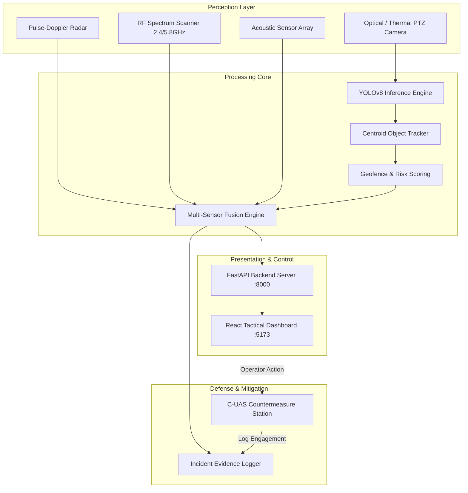

<div align="center">


# 🛡️ Drone Threat Command & Detection System
### Enterprise Multi-Sensor Airspace Defense, Geofencing & C-UAS Countermeasures

[](https://www.python.org/)
[](https://fastapi.tiangolo.com/)
[](https://reactjs.org/)
[](https://ultralytics.com/)
[](https://www.docker.com/)
[](https://pytest.org/)
[](LICENSE)

</div>

---

## 📌 Executive Overview

The **Drone Threat Command & Detection System** is an AI-driven, multi-sensor counter-unmanned aircraft system (C-UAS) engineered for critical infrastructure and restricted airspace (airports, military bases, government complexes, and high-security perimeters).

The platform integrates **real-time Computer Vision (YOLOv8)**, **Centroid Object Tracking**, **Pulse-Doppler Radar Simulation**, **RF Telemetry & Spectrum Analysis**, **Dynamic Geofencing**, **Active Electronic Countermeasures**, and a **Tactical React Dashboard**.

---

## 🚀 Key Features

### 👁️ 1. Computer Vision & Target Tracking
- **Ultralytics YOLOv8 Integration**: Real-time identification of airborne targets with confidence scoring.
- **Centroid Object Tracker**: Trajectory tracing, loitering calculation, and velocity estimation ($px/frame$).
- **Live MJPEG Web Stream (`/video_feed`)**: Zero-latency in-browser live camera stream with bounding box overlays and target tags.

### 📡 2. Multi-Sensor Data Fusion (C-UAS)
- **Pulse-Doppler Radar Scope**: Interactive circular 360° radar canvas plotting target azimuth, range ($m$), elevation, velocity, and Radar Cross Section (RCS).
- **RF Spectrum Analyzer**: Live monitoring of 2.4 GHz / 5.8 GHz communication bands, signal RSSI ($dBm$), signal-to-noise ratio ($SNR$), and Remote ID broadcasts (DJI OcuSync, Autel SkyLink, ExpressLRS).
- **Acoustic Signature Detection**: Propeller harmonic frequency analysis for visual blind-spot target confirmation.

### 🛑 3. Dynamic Geofencing & Risk Scoring
- Multi-tier polygon/rectangle restricted zones (e.g., *Runway Approach*, *Terminal Roofline*, *Fuel Depot*).
- Multi-factor threat scoring ($0-100$) evaluating zone intrusion, velocity towards boundary, track duration, and size in frame.
- Automatic classification into **Low**, **Medium**, **High**, and **Critical** severities.

### ⚡ 4. Active Defense & Electronic Countermeasures
- Interactive operator command station with dispatch actions:
  - **Directional RF Jammer**: Sever command link to force Return-To-Home (RTH) or safe descent.
  - **GNSS Spoofing Defense**: Inject virtual airspace boundaries.
  - **Acoustic Deterrent Siren**: High-decibel audible deterrence.
  - **Air Traffic Control (ATC) Dispatch**: Immediate automated advisory to tower authorities.
- Persistent audit logging of all defensive engagements.

### 🚨 5. Audio-Visual Tactical Alerting & Export Center
- **In-Browser Web Audio Synthesizer**: Realistic tactical alarm audio chirps for critical perimeter breaches.
- **Multi-Format Exporting**: Instant downloads for **CSV**, **JSON**, and structured **Text Incident Reports**.
- **Evidence Snapshots**: Automated high-resolution JPEG capture of all intrusion events.

---

## 🏗️ System Architecture



---

## 🛠️ Technology Stack

| Layer | Technologies |
|---|---|
| **AI / Vision** | Python 3.10+, Ultralytics YOLOv8, OpenCV, NumPy |
| **Backend & API** | FastAPI, Uvicorn, Asynchronous WebSockets / MJPEG, Pytest |
| **Frontend UI** | React 18, Vite, HTML5 Canvas (Radar Scope), Web Audio API, Modern CSS |
| **Storage & Logs** | JSONL, CSV, Local Snapshot Storage |
| **DevOps** | Docker, Docker Compose, GitHub Actions CI/CD |

---

## 📁 Repository Structure

```text
DroneDetectionSystem/
├── api.py                    # FastAPI application, streaming & telemetry endpoints
├── main.py                   # Detection pipeline (webcam, video, image)
├── security.py               # Sensor fusion, geofencing, threat scoring
├── tracker.py                # Centroid tracker and velocity estimation
├── reporting.py              # Multi-format reporting (CSV, JSON, Text)
├── security_config.json      # Configurable risk weights & restricted zones
├── requirements.txt          # Python dependencies
├── Dockerfile                # Multi-stage production container definition
├── docker-compose.yml        # Multi-service stack orchestration
├── .dockerignore             # Clean build context
├── LICENSE                   # MIT License
├── start_api.bat             # Quick launch script for backend
├── start_frontend.bat        # Quick launch script for frontend
├── start_live_detector.bat   # Quick launch script for standalone detector
├── start_dashboard_only.bat  # Quick launch script for both backend & frontend
├── .github/
│   └── workflows/
│       └── ci.yml            # Automated CI testing & build pipeline
├── tests/                    # 100% Passing Automated Pytest Suite
│   ├── test_api.py
│   ├── test_reporting.py
│   ├── test_security.py
│   └── test_tracker.py
├── frontend/                 # React 18 + Vite Tactical Dashboard
│   ├── package.json
│   ├── vite.config.js
│   ├── dist/                 # Production pre-built assets
│   └── src/
│       ├── App.jsx           # Main UI, Radar canvas, C-UAS, Video player
│       ├── main.jsx
│       └── styles.css
├── outputs/                  # Generated incident evidence & logs
│   ├── alerts/
│   ├── logs/
│   └── uploads/
└── sample_inputs/            # Sample imagery for offline simulation
```

---

## ⚡ Quickstart Guide

### Option 1: Easiest One-Click Launch (Windows)

Double-click `start_dashboard_only.bat` or run:
```bat
start_dashboard_only.bat
```
Then navigate to: **`http://localhost:5173`** (Frontend) or **`http://localhost:8000/docs`** (Swagger API).

---

### Option 2: Docker / Docker Compose

```bash
docker-compose up --build
```
Access the system at **`http://localhost:8000`**.

---

### Option 3: Manual Installation

#### 1. Backend Setup:
```bash
python -m pip install --upgrade pip
pip install -r requirements.txt
python -m uvicorn api:app --host 127.0.0.1 --port 8000 --reload
```

#### 2. Frontend Setup:
```bash
cd frontend
npm install
npm run dev
```

---

## 🧪 Automated Testing Suite

The repository includes a comprehensive `pytest` suite testing tracking, risk calculations, telemetry generation, and API responses:

```bash
pytest -v
```

Output:
```text
tests/test_api.py::test_health_endpoint PASSED                           [  5%]
tests/test_api.py::test_config_endpoint PASSED                           [ 10%]
tests/test_api.py::test_summary_endpoint PASSED                          [ 15%]
tests/test_api.py::test_sensors_telemetry_endpoint PASSED                [ 20%]
tests/test_api.py::test_countermeasures_status_endpoint PASSED           [ 25%]
tests/test_api.py::test_trigger_countermeasure_valid PASSED              [ 30%]
tests/test_api.py::test_report_endpoints PASSED                          [ 40%]
tests/test_reporting.py::test_build_text_report PASSED                   [ 45%]
tests/test_reporting.py::test_build_csv_report PASSED                    [ 50%]
tests/test_reporting.py::test_build_json_export PASSED                   [ 55%]
tests/test_security.py::test_calculate_risk_score_and_severity PASSED    [ 80%]
tests/test_security.py::test_generate_sensor_telemetry PASSED            [ 85%]
tests/test_tracker.py::test_tracker_lifecycle PASSED                     [100%]

============================= 20 passed in 2.40s =============================
```

---

## 📡 API Reference

| Method | Endpoint | Description |
|---|---|---|
| `GET` | `/health` | System health check & version info |
| `GET` | `/video_feed` | Real-time MJPEG live camera stream |
| `GET` | `/sensors/telemetry` | Multi-sensor radar tracks, RF frequencies & audio telemetry |
| `GET` | `/countermeasures/status` | Active & historical C-UAS defense engagements |
| `POST`| `/countermeasures/trigger`| Dispatch C-UAS mitigation (Jamming, GNSS Override, Siren, ATC) |
| `GET` | `/summary` | Operational overview & active threat counts |
| `GET` | `/analytics` | Time-series trend and zone breach statistics |
| `GET` | `/alerts` | Incident history with evidence image URLs |
| `GET` | `/report` | Structured text incident report |
| `GET` | `/report/csv` | Download incident logs as CSV file |
| `GET` | `/report/json` | Download incident logs as JSON |
| `POST`| `/analyze-image` | Upload one-off photo for instant target analysis |
| `POST`| `/detector/start` | Launch hardware camera detector subprocess |
| `POST`| `/detector/stop` | Terminate camera detector subprocess |

---

## 📄 License

This project is licensed under the [MIT License](LICENSE) - see the LICENSE file for details.
